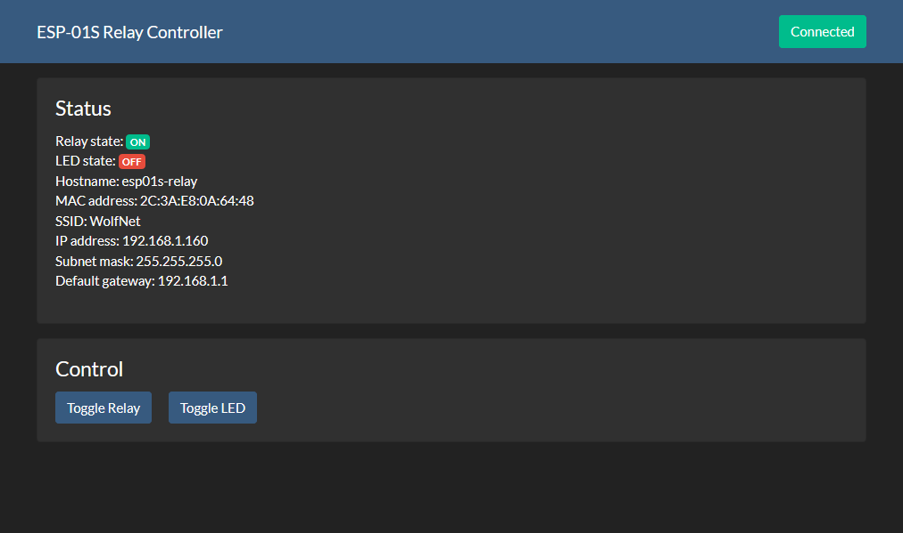
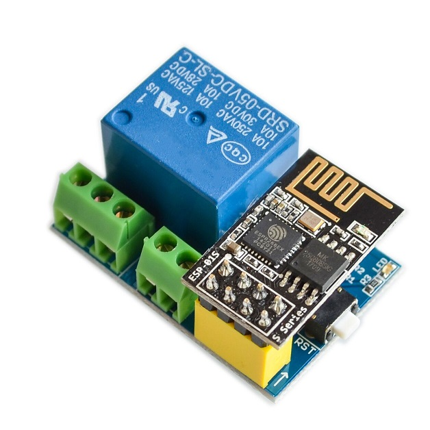
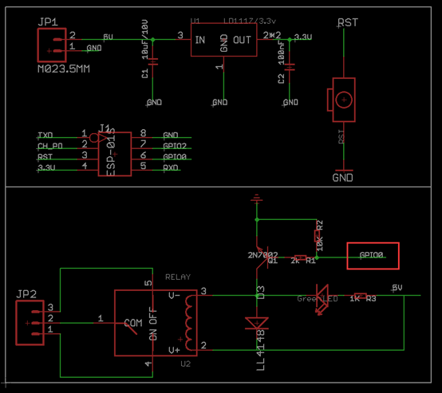

ESP-01S Relay Firmware
======================

Firmware for controlling an ESP-01S-based IoT relay.

Schematic
---------

Version 1.0 of this relay board requires an additional jumper between VCC and CH_PD and a 10k resistor between VCC and GPIO0 to boot the ESP-01S from flash.

License
-------
This project is published under the MIT License. For more informaion, please see [`LICENSE`](LICENSE).
